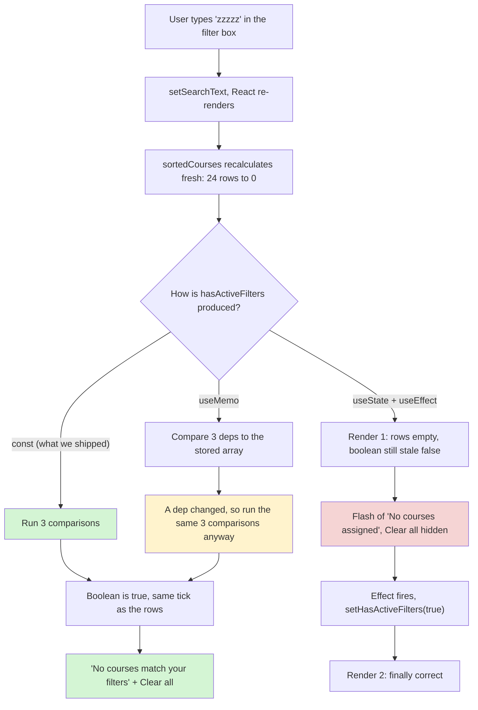
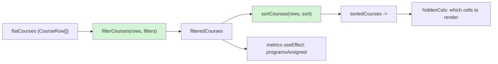
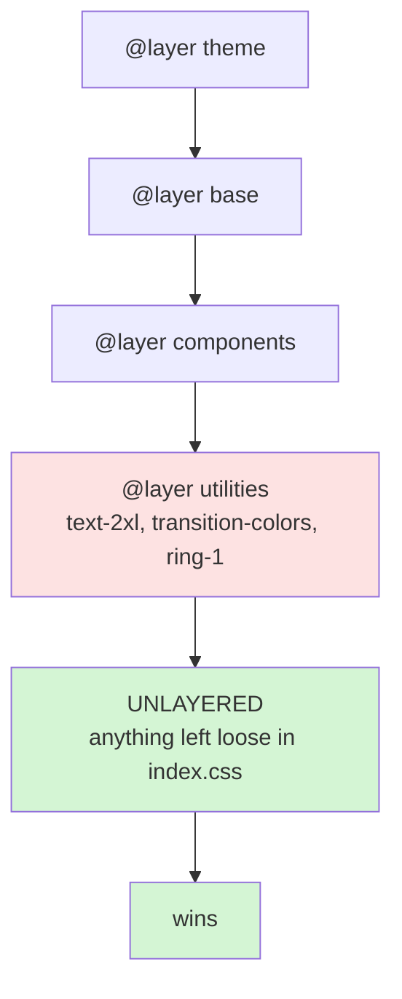
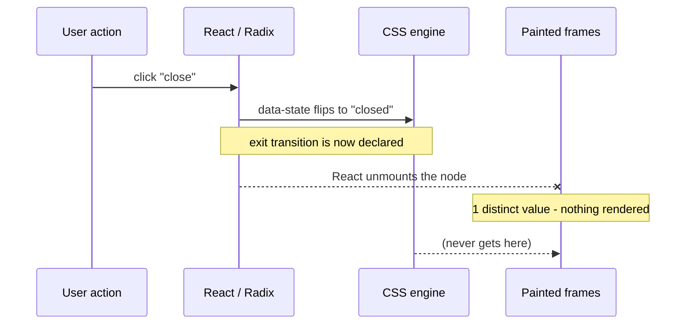
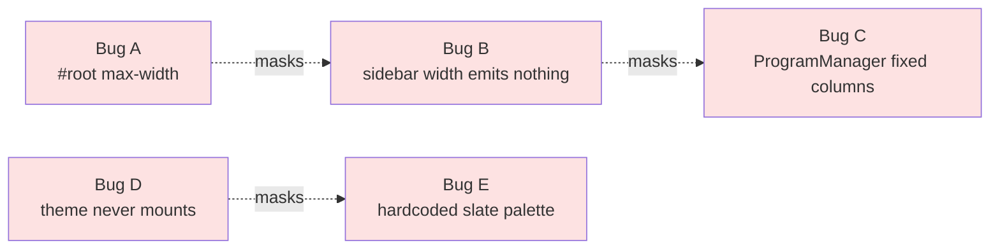
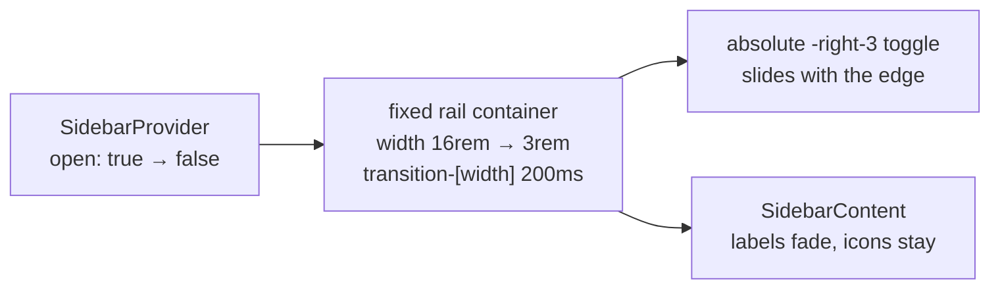

# StudentProgressView learning log

## The story so far

`StudentProgressView` replaced one large card per program with one row per
course. A supervisor can scan the table and narrow its rows by level, status, or
search text.

The old hierarchy hid courses below program headings. The table keeps the
program on each `CourseRow`, so it preserves that context without splitting the
list into separate cards.

---

## Cast and crew (architecture)

### The data pipeline: from hierarchy to rows

This is the same conversion as turning a departmental crew list into a call
sheet.

Before, the list is grouped by department:

```
Production
├── Department: Camera
│   ├── Cinematographer
│   ├── Camera Operator
│   └── Focus Puller
├── Department: Sound
│   ├── Sound Designer
│   └── Boom Operator
└── Department: Lighting
    ├── Gaffer
    └── Best Boy
```

After, each person gets a row and the department becomes a column:

```
Name             | Department   | Role
Cinematographer  | Camera       | Lead
Camera Operator  | Camera       | Support
Focus Puller     | Camera       | Support
Sound Designer   | Sound        | Lead
Boom Operator    | Sound        | Support
Gaffer           | Lighting     | Lead
Best Boy         | Lighting     | Support
```

`StudentProgressView` makes the same transformation.

Before:

```typescript
HydratedProgram[] = [
  {
    program: { name: "Sales Training", id: "prog_1" },
    courses: [Course1, Course2, Course3],
    enrollments: [Enrollment1, Enrollment2, Enrollment3]
  },
  {
    program: { name: "Leadership", id: "prog_2" },
    courses: [Course4, Course5],
    enrollments: [Enrollment4]
  }
]
```

After `flatMap()`:

```typescript
CourseRow[] = [
  { course: Course1, program: prog_1, enrollment: Enrollment1, status: "Incomplete" },
  { course: Course2, program: prog_1, enrollment: Enrollment2, status: "Incomplete" },
  { course: Course3, program: prog_1, enrollment: Enrollment3, status: "Not Enrolled" },
  { course: Course4, program: prog_2, enrollment: Enrollment4, status: "Incomplete" },
  { course: Course5, program: prog_2, enrollment: undefined, status: "Not Enrolled" }
]
```

### Components and data types

`src/components/progress/StudentProgressView.tsx`:

- Fetches all data (roster, assignments, enrollments, programs, catalog)
- Hydrates programs with course and enrollment data
- Flattens hierarchical data into table rows
- Manages filter state (which programs are selected)
- Renders summary stats, filter badges, and the table

`CourseRow` carries the fields that one table row needs:

```typescript
export interface CourseRow {
  course: CourseCatalogItem; // Full course object (courseId, courseTitle, levelName, trainingTypeName, totalDays)
  program: SupervisorProgram; // Full program object (id, programName, description, etc.)
  enrollment?: CourseEnrollment; // Optional enrollment record
  status: CourseStatus; // "Completed" | "Incomplete" | "Not Enrolled"
}
```

---

## Behind the scenes (decisions and patterns)

### Decision 1: use `flatMap()` for table rows

`map()` and `flatMap()` produce different shapes:

- `.map()` = transform each item, keep the same count
- `.flatMap()` = transform each item, then flatten nested arrays into one level

For example:

```
Input:  [Program1: [Course1, Course2, Course3], Program2: [Course4, Course5]]
map():  [[Row1, Row2, Row3], [Row4, Row5]]  ← Nested arrays
flatMap(): [Row1, Row2, Row3, Row4, Row5]   ← One flat array ✓
```

The table expects `CourseRow[]`, not `CourseRow[][]`.

### Decision 2: join records by `courseId`

The course catalog and enrollment response arrive as separate arrays. Both
records contain a `courseId`, so the view uses that field as the join key:

```typescript
// For each course, find its corresponding enrollment
const enrollment = enrollments.find((e) => e.courseId === course.courseId);
//                                          ↑ matching key
```

This works like matching camera takes by timecode. The shared identifier
connects records from different sources.

### Decision 3: use the narrowest useful scope

React state belongs to a component instance:

- `useState` = tied to React component instance, can't be exported
- Regular functions = can be exported if they don't use hooks

`getCourseStatus()` needs `studentEnrollments`, so it lives inside the component
and outside the fetching effect.

Event handlers that update filter state also live in the component body because
JSX calls them.

Use these boundaries:

- Data fetching logic = inside `useEffect`
- User interaction handlers = component body
- Pure utilities (no dependencies) = can be extracted to utils files

### Decision 4: derive course status from enrollment

`CourseEnrollment` contains an optional status:

```typescript
CourseEnrollment {
  courseId: number;
  enrolledDate: string;
  // NO completion date or status field
}
```

The view maps enrollment records to display status:

- A completed enrollment exists → Status: "Completed"
- Another enrollment exists → Status: "Incomplete"
- No enrollment exists → Status: "Not Enrolled"

Old fixture rows have no `status`. If an enrollment exists without a completed
status, the course is incomplete. A missing enrollment means the learner has not
enrolled.

---

## Bloopers (bugs and fixes)

### Blooper 1: `CourseRow` used strings instead of domain types

The first interface discarded information:

```typescript
export interface CourseRow {
  program: string; // ❌ Wrong - just a string
  status: string; // ❌ Wrong - no type safety
}
```

The table needs `program.id` for filtering and `program.programName` for
display. The corrected interface keeps the program object and restricts status
to valid values:

```typescript
export interface CourseRow {
  program: SupervisorProgram; // ✅ Full object with id, name, etc.
  status: CourseStatus; // ✅ Type-safe union: "Completed" | "Incomplete" | "Not Enrolled"
}
```

Model the values that callers use. A `string` hides both the program fields and
the allowed status values from TypeScript.

### Blooper 2: nested callbacks hid a closing parenthesis

The callback ended with the wrong delimiter:

```typescript
courses.map((course) => ({
  course,
  program,
  status: getCourseStatus(course.courseId),
})); // ❌ Semicolon instead of closing paren
```

The corrected expression closes the object, the callback, and `map()` in that
order:

```typescript
courses.map((course) => ({
  course,
  program,
  status: getCourseStatus(course.courseId),
})); // ✅ Close map with paren
```

Indent each nesting level so the delimiters line up:

```
flatMap(            // Open 1
  arrow =>
    map(            // Open 2
      arrow => ({ })  // Close object, close 2
    )               // Close 1
)
```

### Bloopers 3: The Animation That Was Never There (ANIM-002, 2026-08-26)

**The Bug:** every accordion in the student dashboard snapped open with no
transition. The audit blamed this line in `src/components/ui/accordion.tsx`:

```tsx
className =
  "... data-[state=closed]:animate-accordion-up data-[state=open]:animate-accordion-down";
```

Those keyframes are not defined anywhere in the repo. `tailwindcss-animate` does
not ship them - they are shadcn's own `tailwind.config` entries you are expected
to paste in - and this project's `tailwind.config.js` had no `keyframes` block
at all. It was also never loaded: Tailwind v4 only reads a JS config when a
stylesheet declares `@config`, and none did.

**Why it happened:** Tailwind does not error on a class it cannot resolve. It
emits nothing and moves on. `animate-accordion-down` looks exactly like a
working class in source, in review, and in the browser's DOM inspector.

**The Fix - and the part that matters:** the file was dead code.
`StudentDashboard.tsx` imports the Radix primitives directly:

```tsx
import * as Accordion from "@radix-ui/react-accordion";   // not the vendored wrapper
...
<Accordion.Content className="px-4 pb-4 pt-2">           // no animation class at all
```

Three independent implementations all found this before writing a line. Fixing
the file the plan named would have passed every check and animated nothing.

**The Lesson:** a broken thing and an unused thing look identical from the
outside. Before fixing what a bug report points at, confirm the code is
_reachable_: `grep -rn "ui/accordion" src/` was the whole investigation, and it
returned nothing.

### Bloopers 4: `transform` Does Not Animate `scale` (ANIM-004, 2026-08-26)

**The Bug:** buttons got press feedback that visibly worked and never actually
animated.

```tsx
// the cva base string
"transition-[color,background-color,border-color,transform] duration-(--duration-micro) ease-out
 active:scale-(--scale-press)"
```

Press it and it depresses. Release and it springs back. Both instantaneous - no
interpolation at all.

**Why it happened:** Tailwind v4 compiles `scale-*` to the **standalone `scale`
property**, not to `transform: scale()`:

```css
.active\:scale-\(--scale-press\):active {
  scale: var(--scale-press);
}
```

`transform` and `scale` are separate animatable properties in CSS. A transition
on one does not touch the other. Measured with a synthetic element:

```
transition-property: transform  ->   1 distinct value over 200ms   (a snap)
transition-property: scale      ->  13 distinct values             (animates)
```

**The Fix:** name the property that actually changes.

```tsx
"transition-[color,background-color,border-color,scale] ..."; // scale, not transform
```

**The Lesson:** this one fooled a careful check. The implementation read
`getComputedStyle(btn).transitionDuration` on mouseup, got `0.1s`, and concluded
the settle worked. That number was real - the declaration was on the element. It
just governed a property list that did not include the thing moving. **Reading a
declaration proves the CSS is there. Only counting frames proves something
moved.**

### Bloopers 5: The Focus Ring Nobody Could See (ANIM-010, 2026-08-26)

**The Bug:** `src/index.css` carried this, inside `@layer base`:

```css
/* FORCE REMOVE ALL BLUE FOCUS RINGS */
*,
*:focus,
*:focus-visible {
  outline: none !important;
  --tw-ring-shadow: 0 0 #0000 !important;
}
```

Every focus indicator in the application, gone. Not just the browser default -
zeroing `--tw-ring-shadow` also defeats the `focus-visible:ring-1` that nine
components correctly ask for. A keyboard user could not tell where they were,
anywhere. WCAG 2.1 AA failure, 2.4.7.

**Why it happened:** `git log -S "FORCE REMOVE"` found it landed in one commit
alongside **two other kill switches** - it also deleted shadcn's correct fix
(`@apply border-border outline-ring/50`) and set `--ring: transparent`. The
reason all three shipped together: `--color-ring` was not wired to `--ring` at
that commit, so the correct fix could not work. The author tried it, saw nothing
change, and escalated. Twice.

That wiring bug is long fixed (`--color-ring: var(--ring)`), so the rule had
outlived what it patched by months.

**The Fix:** delete the blanket rule, add a branded `:focus-visible` outline.
But that alone was not enough:

```css
--primary: #ff5000;
--ring: #ff5000; /* identical */
```

The `default` and `secondary` Button variants fill with `bg-primary`. A flush
ring on them was orange on orange - **invisible**, not merely low-contrast.
Fixed with a `ring-offset-2` so a background-coloured gap separates the two.

**The Lesson:** when you find a deliberate-looking hack, read the commit that
introduced it before removing it. The comment said "blue", the app's accent is
orange, and the author's actual complaint (the browser's default blue ring) was
legitimate - only the blast radius was wrong. Knowing that is what stops the
next person re-adding it.

### Bloopers 6: `cn()` Silently Deletes Transitions (ANIM-004 / ANIM-006, 2026-08-26)

**The Bug:** adding a fade to a card deleted its hover shadow. No error, no
warning.

**Why it happened:** `cn()` runs `tailwind-merge`, which treats **every**
`transition-*` class as one mutually-exclusive group and keeps only the last
one. Run it directly and watch:

```
base:    transition-shadow duration-(--duration-micro) ease-out
+ fade:  transition-opacity duration-(--duration-swap) ease-out
merged:  cursor-pointer transition-opacity duration-(--duration-swap) ease-out
         ^ transition-shadow is gone
```

This bit twice: once when a `cva` variant's `transition-colors` ate the base
string's list, and again when a crossfade ate a card hover.

**The Fix - three sanctioned escapes**, in order of preference:

```tsx
// 1. One arbitrary-PROPERTY declaration. Per-property timing, collision impossible.
"[transition:box-shadow_var(--duration-micro)_var(--ease-out),opacity_var(--duration-pop)_var(--ease-out)]";

// 2. Drive one of them with `animation` instead - a disjoint group, so they coexist.
"animate-[stagger-in_var(--duration-swap)_ease-out_both]";

// 3. Put them on different elements.
```

Note `transition-[a,b]` is **not** option 1. That form sets
`transition-property` only and pulls timing from `--tw-duration`, so every
listed property shares one duration.

**The Lesson:** an element carries at most one `transition-*` utility. This is
now written into `MOTION-CONTRACT.md` as rule 4, because knowing it in the
abstract did not stop it happening twice.

---

## Director's commentary

### 1. Match the data shape to the UI

The table renders one course per row, so calculate `CourseRow[]` before
rendering it. Keep nested program data only where the UI still displays programs
as groups.

### 2. Define interaction rules before the handler

Before writing `toggleProgramFilter()`, you reasoned through the scenarios:

- Click a selected badge → unselect it
- Click an unselected badge → select it
- Multiple badges can be selected simultaneously

These rules determine the state update. Writing them first exposes missing cases
before JSX hides them among rendering details.

### 3. Scope values by lifetime

`StudentProgressView` uses three relevant scopes:

1. **Component level:** `selectedPrograms` state - accessible in JSX
2. **useEffect level:** `studentEnrollments` - only available during fetch
3. **Local function level:** `getCourseStatus` - can see `studentEnrollments`
   from its parent scope

#### `useEffect` is for external synchronization

Fetching is one side effect. Effects also subscribe to external systems, update
APIs outside React, and release those resources:

- Fetching data ✅
- Setting up event listeners ✅
- Updating the DOM directly ✅
- Starting timers/intervals ✅
- Cleaning up resources ✅

Keep calculations and event handlers outside effects:

- Calculating values from props/state ❌
- Transforming data ❌
- Event handlers ❌
- Rendering logic ❌

```typescript
// ✅ INSIDE useEffect - interacts with external world
useEffect(() => {
  const [data] = await api.fetch();  // Fetching
  setHydratedPrograms(data);         // Side effect: updating state
}, [studentId]);

// ❌ OUTSIDE useEffect - just logic/calculations
const toggleProgramFilter = (id) => {  // User interaction handler
  setSelectedPrograms(prev => ...);
};

const filteredCourses = selectedPrograms.length > 0
  ? flatCourses.filter(...)           // Data calculation
  : flatCourses;
```

If filtering lives in the fetching effect, a filter change can trigger network
work or leave derived rows one render behind. Calculating from current state
during render keeps both in sync.

### 4. Join records with shared keys

Your courses and enrollments don't come pre-grouped. They're separate API
responses. Connect them using `courseId` as the join key:

```typescript
enrollments.find((e) => e.courseId === course.courseId);
```

The result is the enrollment for the same course, or `undefined` when no such
record exists.

### 5. Derive display status

In your data:

- `course` object: stores what the course IS (title, duration, level)
- `enrollment` object: stores whether the learner enrolled and may store
  `"Completed"`
- `CourseStatus`: maps that enrollment to the three labels shown by the table

Deriving status avoids a second stored value that can disagree with the
enrollment. When the selected learner's enrollment changes, the next calculation
produces the new display status.

### 6. **Not Every Derived Value Earns a `useMemo`** (ETH-9, 2026-08-26)

`StudentProgressView` asks "are any filters active?" in two places. The **Clear
all** button uses it to decide whether to show itself, and the empty table cell
uses it to pick between "No courses match your filters" and "No courses
assigned". ETH-9 gave that question one name:

```tsx
// Three comparisons, recomputed on every render, on purpose.
// Read at two sites 90 lines apart: the Clear all button and the empty-state cell.
const hasActiveFilters =
  selectedStatuses.length > 0 || selectedLevels.length > 0 || searchText !== "";
```

The interesting decision is what it is **not**. Three options were on the table.

**Option A, plain `const`.** Recompute every render. Three comparisons,
effectively free.

**Option B, `useMemo`.** People reach for this reflexively on anything called
"derived state", but look at what `useMemo` actually does. It stores the
previous result plus a dependency array, and on every render it walks that array
comparing each dep to the stored one. Only then does it decide whether to skip
the work. Here the work being skipped is three comparisons, and the deciding
costs three comparisons plus the storage. **You pay more to avoid the work than
the work costs.** The tell is one line up in the same file: `filteredCourses`
iterates all 24 rows and is not memoized either.

**Option C, `useState` plus a `useEffect` to keep it current.** This one is not
just wasteful, it is wrong, and the reason is worth sitting with.
`sortedCourses` is recalculated fresh on every render. A `useState` boolean is
not; it lags one render behind whatever effect updates it. So the frame after
you type into the filter box, the rows are already gone while the boolean still
says "no filters are active" - and the table renders **"No courses assigned"**
underneath a hidden **Clear all** button. The row list and the sentence
explaining it would be reading from two different points in time.



**The post-production analogy.** `useMemo` is a render cache. You cache a shot
because rendering it costs four hours. You do not cache a text overlay you can
redraw live in the viewer, because then you are managing a cache folder,
checking timestamps, and invalidating stale versions - all of it more work than
redrawing. And Option C is baking that overlay out to a separate file you have
to remember to re-export whenever the text changes. Miss one export and your
timeline and your delivery disagree.

**The rule to carry forward:** `useMemo` buys you skipped work, and it is not
free. Reach for it when the work is genuinely expensive (a big sort, a large
filter, a new object or array identity that a `memo` child depends on). A
boolean from three comparisons is none of those. Measure the thing you are
avoiding before you pay to avoid it.

The second half of ETH-9 is the reason this const exists at all. That expression
used to be typed out twice, at the button and at the cell, with the operands in
a different order at each site. `||` does not care about order, so they behaved
identically - the mismatched order is just the fingerprint of two separate
typings. The failure it was set up for is quiet: add a fourth filter, update the
copy sitting next to the toolbar you happen to be editing, miss the one 90 lines
away inside `<TableBody>`, and a user gets "No courses assigned" with **Clear
all** sitting directly above it contradicting the sentence. No build break. No
failing test. **Naming a duplicated expression once is what stops the two copies
from drifting apart later.**

### 7. Extract the rule before testing it (ETH-39, 2026-08-26)

ETH-39 asked for tests over the filter, sort and column-toggle behaviour. The
first move was not a test file. It was noticing that the thing to test lived in
two places.

At that revision, `StudentProgressView` filtered rows twice: once inside the
metrics `useEffect` and once during render. The same comparisons appeared 40
lines apart. ETH-47 later removed filters from the summary metrics because those
cards describe the learner's full workload.

```ts
// src/components/progress/courseTable.ts - one predicate, both callers.
// (row: CourseRow, filters: CourseFilters) -> boolean
export function matchesFilters(
  row: CourseRow,
  filters: CourseFilters
): boolean {
  const matchesLevel =
    filters.levels.length === 0 ||
    filters.levels.includes(row.course.levelName);
  const matchesStatus =
    filters.statuses.length === 0 || filters.statuses.includes(row.status);

  return matchesLevel && matchesStatus && matchesSearch(row, filters.search);
}
```

Read the two halves of each line separately, because they are two different
rules:

- `filters.levels.length === 0 ||` is **"an empty facet means all"**. No
  checkboxes ticked is not a filter that matches nothing, it is the absence of a
  filter.
- `filters.levels.includes(...)` is **OR within a facet**. Tick Basic and
  Advanced and you get both, not the empty intersection of both.
- The `&&` between the three is **AND across facets**. Basic + Not Enrolled
  means rows that are both.



Notice where `hiddenCols` sits in that chain: at the very end, on the render,
downstream of both `filterCourses` and `sortCourses`. That is the whole reason
hiding a column cannot lose row data - the Set is never consulted while rows are
being selected or ordered, only while cells are being drawn. The test for it
asserts exactly that: hide Status, then check the same row still shows `#11`,
`Basic` and `CNC Fundamentals`.

At the time, extracting first let one function cover both callers. ETH-47
changed the ownership: `filterCourses()` now owns table selection only, while
metrics derive from `flatCourses`.

**Why the commits are in that order.** The render tests are the first commit,
sitting on top of the _old_ component, before `courseTable.ts` exists. They pass
there. Then the refactor lands and they still pass. That ordering is the entire
proof that the extraction changed no behaviour, and it only works in that
direction: tests written after a refactor can only tell you the new code is
self-consistent. Check out the first commit and run
`bunx vitest run src/components/progress` if you want to watch it.

**Proving the tests actually bite.** The ticket asked for tests that fail if a
predicate is inverted, so that got checked rather than assumed. That check is a
committed script, not a story:

```bash
bun run test:mutants
```

`scripts/mutation-check.mjs` breaks one rule at a time, reruns the suite, and
requires it to go red. It refuses to start unless the baseline is green, because
a suite that was already red would score every mutant as "killed" for free.

```
killed    9 failing  level facet no longer accepts an empty selection as 'all'
killed    3 failing  status facet predicate inverted
killed    8 failing  facets combined with OR instead of AND
killed    1 failing  search stops looking at the program name
killed   12 failing  blank search no longer matches every row
killed    6 failing  sort direction flipped
killed    4 failing  level ordering collapsed so Basic and Advanced tie
killed    2 failing  status ordering collapsed
killed    1 failing  toggleColumn can hide a column but never show it again
```

The mutation script covers the pure table predicates, sorting, and column
visibility. ETH-47's component regression test owns the separate boundary that
table filters must not change the summary cards. That behavior is not a table
helper mutation: the cards deliberately derive from `flatCourses` before
`filterCourses()` runs.

A green suite is not evidence. A suite you have watched go red on demand is. The
difference between those two is a file a reviewer can rerun, which is why the
check is `scripts/mutation-check.mjs` and not a paragraph in this doc claiming
it was done.

**The post-production analogy.** This is building the LUT once and applying it
to every shot, instead of eyeballing the same grade twice on two different
monitors. When the look changes, you change the LUT. And the mutation pass is
punching a deliberately wrong value into the LUT to confirm the monitors are
actually reading from it.

**One thing that came along for the ride:** the old `sortedCourses` was wrapped
in `useMemo` with `[filteredCourses, sort]` as deps. `filteredCourses` is a
fresh array on every render, so that dep never compared equal and the memo never
once hit - it paid the comparison and did the sort anyway. Same lesson as ETH-9,
one file over: a `useMemo` whose deps change identity every render is pure
overhead wearing a performance costume.

### 8. **Unlayered CSS Beats Every Tailwind Utility** (ANIM audit, 2026-08-26)

Four separate defects in this codebase trace to one mechanism, and once you see
it you can spot the rest in a minute.

Tailwind emits its utilities inside `@layer utilities`. **A rule written outside
any layer beats a layered rule regardless of specificity.** Not because it is
more specific - because unlayered styles are a higher cascade origin than any
named layer. `index.css` is full of unlayered rules, so anything left in it
silently outranks the entire utility system.

```css
/* src/index.css - all four of these were unlayered, all four won */

h1 {
  font-size: 3.2em;
} /* every <h1> rendered 51.2px, ignoring text-2xl */
button {
  transition: border-color 0.25s;
} /* ate transition-colors on every button */
*,
*:focus-visible {
  outline: none !important;
} /* removed every focus ring app-wide */
```



Read the diagram bottom-up: the _last_ box wins, and it is not the one holding
your utilities.

**The useful half of this.** The same mechanic is the correct tool when you
genuinely want to override everything. The reduced-motion block in `index.css`
is deliberately unlayered:

```css
@media (prefers-reduced-motion: reduce) {
  *,
  *::before,
  *::after {
    /* Unlayered on purpose, so this outranks duration-500 and every other utility
       WITHOUT a single !important - which means a component can still opt out. */
    transition-duration: var(--duration-micro);
  }
}
```

A blanket `!important` would have won too, and taken away every component's
ability to opt out. Layer position gets you the same authority and leaves the
escape hatch open.

**What you can now predict:** any styling bug that reads as "my Tailwind class
is being ignored" should send you to `index.css` first, looking for a bare
element selector. Not to the component.

### 9. **Watch Frames, Not Declarations** (ANIM audit, 2026-08-26)

Across fifteen tickets, the single most common failure was **motion that is
correctly declared and never gets a frame to run**. It happened four times, by
four unrelated mechanisms:

| What ate the animation                                                        | Ticket |
| ----------------------------------------------------------------------------- | ------ |
| Radix forces `transitionDuration = "0s"` then reads `getBoundingClientRect()` | 002    |
| The button's own click handler unmounts it mid-spring-back                    | 004    |
| React removes the dialog subtree before Radix `Presence` can defer            | 011    |
| The transition names `transform`; the thing moving is `scale`                 | 004    |

None of these fail a build, a type check, or a test. All of them survive a
`getComputedStyle()` check, because the declaration genuinely _is_ on the
element.

The check that works is boring and mechanical:

```ts
// Sample the property every animation frame and count how many DISTINCT values appear.
// One value means it snapped. Anything above ~8 over 300ms means it interpolated.
const frames: string[] = [];
await new Promise<void>((resolve) => {
  const t0 = performance.now();
  (function tick() {
    frames.push(getComputedStyle(el).opacity); // the property that should move
    if (performance.now() - t0 < 400) requestAnimationFrame(tick);
    else resolve();
  })();
});
new Set(frames).size; // 1 = broken, 13 = working
```



That sequence is ticket 011 exactly. The transition was perfect; the element
stopped existing before the compositor saw it.

**The refinement that came later.** Ticket 011 added a second question:
frame-counting proves the _element_ animated, not that it animated the _right
thing_. A dialog whose content is nulled on close still produces 14 clean
frames - of an empty box. So the sample tracked the dialog's **text** alongside
its opacity, and asserted the title was present in every frame.

**What you can now predict:** any "the animation isn't working" report has two
candidate causes, and they need different tools. Wrong values -> read the
computed style. No values -> count the frames. Guessing between them is what
costs the afternoon.

### 10. **A Long-Standing Bug Can Be Load-Bearing** (ANIM audit, 2026-08-26)

Three times in this audit, fixing something exposed a second bug the first one
had been hiding. It happened often enough to be a rule rather than a
coincidence.

**Ticket 008.** The plan said `App.css`'s
`#root { max-width: 1280px; padding: 2rem }` was pushing content under the
sidebar and clipping program titles. Three independent measurements said the
opposite: deleting it made the clipping **32px worse**. The real cause was
`w-[--sidebar-width]` emitting nothing, so the layout never reserved the
sidebar's 256px - and `#root`'s stale padding had been accidentally covering
part of that gap.

**Ticket 013.** Fixing that width then broke `ProgramManager`, which lays out
two fixed 550px columns:

```
viewport 1024 - sidebar 256   =  768px available
two 550px columns + 24px gap  = 1124px needed        -> 356px shortfall
```

The `flex-1` column absorbed the whole shortfall and its `overflow-hidden`
clipped student names and the Invite button, with **no scrollbar** - silent
content loss. The old overlap bug had been giving that row width it was never
entitled to.

**Ticket 015.** The `dark` class was never applied on mount, so nobody had ever
seen dark mode. Fixing four lines of wiring revealed a palette full of
`text-slate-900`, which measures **1.00:1** against the dark background.
Identical luminance. Invisible headings.



**The working rule.** When you fix a visible defect, ask a second question:
_what was this bug holding up?_ Then check the thing it was adjacent to. In two
of the three cases above the answer was "a layout that never had to be correct",
and in the third it was "a colour palette nobody could see".

**The judgment call that follows.** Ticket 013 could have shipped its fix and
filed the `ProgramManager` breakage as a new ticket. It did not, on the grounds
that **the commit which exposes a defect owns it** - shipping a fix alongside a
regression it caused is worse than shipping neither. Same reasoning put the
60-site colour sweep inside ticket 015 rather than after it. A fix that leaves
the app worse in a new way is not finished.

### 11. Keep each learner's facts in that learner's scope (ETH-47, 2026-09-24)

ETH-47 exposed two questions that were accidentally answered from different
scopes. The course table asked whether _any learner_ had an enrollment for a
course. The Programs Assigned card asked how many programs survived the toolbar
filters. Both answers looked plausible until a supervisor changed the student or
typed a search.

```tsx
// StudentProgressView.tsx
// Course ID -> the selected learner's enrollment -> the displayed course status.
const enrollment = studentEnrollments.find(
  (entry) => entry.courseId === courseId
);

return enrollment?.status === "Completed"
  ? "Completed"
  : enrollment
    ? "Incomplete"
    : "Not Enrolled";
```

The previous lookup searched `enrollments`, the complete response for every
learner. Alice could see Incomplete because Bob had enrolled in the same course.
The old two-branch function also made Completed impossible, even when the
fixture had a completed enrollment.

The cards have a different boundary. They answer "what is this student's
workload?" and the table answers "which part of that workload am I looking at?"
That means both status totals and Programs Assigned derive from `flatCourses`,
before `filterCourses` narrows the table.

The table is an edit timeline. The cards are the production report. Trimming the
timeline to find one shot must not change the report's count of shots filmed.
The report reads the full reel, and each learner's status reads only that
learner's enrollment records.

**The test to remember:** use asymmetric fixture data. Give the displayed
learner one completed enrollment and another learner an enrollment in a
different course. A global lookup then produces a different result from a
learner-scoped lookup. Also filter the table to zero rows and assert the cards
do not move. Tests that use the same learner or compare only a nonzero table
cannot catch this kind of scope leak.

---

## Key concepts reference

### `flatMap()`

```typescript
const nested = [
  [item1, item2],
  [item3, item4],
];

const flat = nested.flatMap((items) => items);
// [item1, item2, item3, item4]
```

Use `flatMap()` when each source item produces an array and the caller needs one
array.

### Join by a shared identifier

```typescript
const relatedItem = relatedArray.find(
  (item) => item.commonKey === sourceItem.commonKey
);
```

Use this form when two API responses identify the same entity with the same key.

### Toggle filter state

```typescript
const [selectedFilters, setSelectedFilters] = useState<string[]>([]);

const toggleFilter = (id: string) => {
  setSelectedFilters(
    (prev) =>
      prev.includes(id)
        ? prev.filter((item) => item !== id) // Remove if selected
        : [...prev, id] // Add if not selected
  );
};

const filtered =
  selectedFilters.length > 0
    ? items.filter((item) => selectedFilters.includes(item.id))
    : items;
```

The state array contains selected IDs. The functional update adds an absent ID
or removes a selected ID without reading a stale render value.

---

## Advanced filtering: multi-filter patterns (Phase 8)

### Decision 5: combine filter groups with AND

Phase 8 combined three filter groups:

- Program filter (existing badge toggle)
- Status filter (new dropdown)
- Text search (new input field)

Every active group must match:

```typescript
// Each filter is independent - can be on or off
const filteredCourses = flatCourses.filter((row) => {
  const matchesProgram =
    selectedPrograms.length === 0 || selectedPrograms.includes(row.program.id);

  const matchesStatus =
    selectedStatuses.length === 0 || selectedStatuses.includes(row.status);

  const matchesSearchText = matchesSearch(row, searchText);

  return matchesProgram && matchesStatus && matchesSearchText; // ← AND logic
});
```

An empty group matches every row. A nonempty group matches a row when it
contains that row's value.

### Decision 6: search across multiple fields

Search compares fields with different source types:

- Course title (string)
- Program name (string)
- Level name (string)
- Training type (string)
- Course ID (number)

```typescript
const matchesSearch = (row: CourseRow, search: string): boolean => {
  if (!search) return true; // No search = match everything

  const searchLower = search.toLowerCase();

  return (
    row.course.courseTitle.toLowerCase().includes(searchLower) ||
    row.program.programName.toLowerCase().includes(searchLower) ||
    row.course.levelName.toLowerCase().includes(searchLower) ||
    row.course.trainingTypeName.toLowerCase().includes(searchLower) ||
    row.course.courseId.toString().includes(searchLower) // ← Convert number to string
  );
};
```

Search uses OR within its fields and AND between search and the other filter
groups:

- Search: "Does this row match THIS field OR that field OR..." (OR logic)
- Multi-filter: "Does this row match program AND status AND search" (AND logic)

### Decision 7: allow multiple status selections

The status menu allows multiple selections, so its state is a `CourseStatus[]`:

```typescript
const [selectedStatuses, setSelectedStatuses] = useState<CourseStatus[]>([]);

// Toggle a status on/off
const handleStatusChange = (status: CourseStatus, checked: boolean) => {
  setSelectedStatuses(
    (prev) =>
      checked
        ? [...prev, status] // Add if checked
        : prev.filter((s) => s !== status) // Remove if unchecked
  );
};
```

**In the dropdown:**

```typescript
<DropdownMenuCheckboxItem
  checked={selectedStatuses.includes("Completed")}
  onCheckedChange={(checked) => {
    setSelectedStatuses((prev) =>
      checked
        ? [...prev, "Completed"]
        : prev.filter((s) => s !== "Completed")
    );
  }}
>
  Completed
</DropdownMenuCheckboxItem>
```

The state update is the same toggle used by the program filter. Only the control
differs: this one uses checkbox items instead of badges.

### Decision 8: show filter state in the UI

The filter controls must expose three facts:

- What filters are currently active
- How many results matched their filter
- How to reset filters

```typescript
// Show filter count badge
{selectedStatuses.length > 0 && (
  <span className="ml-2 rounded-full bg-primary px-2 py-0.5 text-xs text-primary-foreground">
    {selectedStatuses.length}
  </span>
)}

// Show clear button only when filters active
{(searchText || selectedStatuses.length > 0 || selectedPrograms.length > 0) && (
  <Button variant="ghost" size="sm" onClick={() => {
    setSearchText("");
    setSelectedStatuses([]);
    setSelectedPrograms([]);
  }}>
    <X className="mr-2 h-4 w-4" />
    Clear All
  </Button>
)}

// Filter-aware empty state
{searchText || selectedStatuses.length > 0 || selectedPrograms.length > 0
  ? "No courses match your filters"
  : "No courses assigned"}
```

The count shows how many statuses are selected. **Clear All** appears only when
a filter is active, and the empty-state copy distinguishes an empty assignment
from a filter with no matches.

---

## Advanced filtering scenarios

### Scenario 1: Search for "CNC"

```
searchText = "cnc"
selectedStatuses = []
selectedPrograms = []
↓
Shows all courses with "CNC" in title/program/level/type
```

### Scenario 2: Filter by "Incomplete" Status Only

```
searchText = ""
selectedStatuses = ["Incomplete"]
selectedPrograms = []
↓
Shows all incomplete courses across all programs
```

### Scenario 3: Combined Filters - "Sales" courses that are "Incomplete"

```
searchText = "sales"
selectedStatuses = ["Incomplete"]
selectedPrograms = []
↓
Shows only Sales courses the student hasn't completed
```

### Scenario 4: Program + Status + Search

```
searchText = "cnc"
selectedStatuses = ["Not Enrolled"]
selectedPrograms = ["prog_manufacturing"]
↓
Shows CNC-related courses in Manufacturing program that student hasn't enrolled in
```

### Scenario 5: Clear All Filters

```
User clicks "Clear All" button
↓
setSearchText("")
setSelectedStatuses([])
setSelectedPrograms([])
↓
Shows all courses again
```

---

## `MetricCard`, `StudentMetrics`, and type organization (2026-01-27)

### Decision 9: share `MetricCard`

`SupervisorDashboard` defined `MetricCard` locally, and `StudentProgressView`
needed the same card. Moving it to `src/components/MetricCard.tsx` gives both
views one implementation:

- **DRY Principle:** Don't repeat component code across files
- **Reusability:** Any view that needs metric display can import it
- **Maintainability:** Bug fixes or styling changes happen in one place

```typescript
// Before: Local definition in SupervisorDashboard.tsx
function MetricCard({ title, value, icon, isLoading, highlight = false }: {
  title: string;
  value: number;
  icon: React.ReactNode;
  isLoading: boolean;
  highlight?: boolean;
}) { ... }

// After: Extract to MetricCard.tsx
interface MetricCardProps {
  title: string;
  value: number;
  icon: React.ReactNode;
  isLoading: boolean;
  highlight?: boolean;
}

export function MetricCard(props: MetricCardProps) { ... }
```

The extraction is justified by two existing callers. A component used once can
remain local until a second caller needs the same contract.

### Decision 10: define the `StudentMetrics` contract

`StudentMetrics` includes the status counts plus their denominator and program
count:

```typescript
export interface StudentMetrics {
  statusCompleted: number; // Raw count
  statusIncomplete: number; // Raw count
  statusNotEnrolled: number; // Raw count
  totalCourses: number; // Context: denominator
  completionPercentage: number; // Context: readable progress
  programsAssigned: number; // Context: workload distribution
}
```

Each field answers a separate supervisor question:

- **Status breakdown:** Supervisors want to know what students are doing
- **Total courses:** Shows proportion (5 completed out of 20 is very different
  from 5 out of 5)
- **Completion %:** Immediate visual understanding of progress (easy to remember
  "60% done")
- **Programs assigned:** Reveals workload distribution (3 programs vs. 1 program
  matters)

The total is the denominator for the status counts and completion percentage.
`programsAssigned` describes how the courses are distributed across programs.

### Decision 11: separate fetching from metric calculation

`StudentProgressView` performs four stages:

1. Fetches data from multiple APIs
2. Hydrates programs with course data
3. Flattens hierarchical data
4. Calculates metrics from flat data

Two effects separate the API request from metric calculation:

```typescript
// First useEffect: Fetch & hydrate data only
useEffect(() => {
  // Fetch roster, assignments, enrollments, programs, catalog
  // Hydrate programs with courses
  // Flatten to flatCourses
  setFlatCourses(flatCourses);
}, [studentId]); // ← Refetch when student changes

// Second useEffect: Calculate metrics from flat data
useEffect(() => {
  if (flatCourses.length === 0) return;

  const metrics = {/* calculate from flatCourses */};
  setMetrics(metrics);
}, [flatCourses]); // ← Recalculate when courses change
```

**Why this matters:**

- **Single Responsibility:** Each hook does one thing
- **Independent Updates:** If flatCourses change, metrics recalculate
  automatically
- **Easier Debugging:** When metrics are wrong, you know it's the second hook
- **Performance:** Doesn't re-fetch data when just recalculating metrics

The fetching effect depends on `studentId`. The metrics effect depends on
`flatCourses`, so a local course update can recalculate cards without fetching
the API responses again.

### Decision 12: choose the completion denominator

**The Formula:**

```
Completion % = (Completed Courses / Total Courses) × 100
```

**Why this formula (not the others)?**

Three possible approaches:

1. **Completion % = Completed / Total** ← This one ✓
   - Shows: "Of all assigned work, X% is done"
   - Best for: Supervisors tracking overall progress
2. **Progress % = (Completed + Incomplete) / Total**
   - Shows: "X% of students are actively working"
   - Best for: Identifying who's engaged vs. idle
3. **Completion Rate = Completed / (Completed + Incomplete)**
   - Shows: "Of courses students started, X% are finished"
   - Best for: Tracking course completion velocity

**For StudentProgressView, option 1 is right because:**

- Supervisors care: "Is this student progressing overall?"
- Not Enrolled courses are incomplete work (can't ignore them)
- Simple to explain: "60% complete" means 60% of work is done

**Implementation:**

```typescript
completionPercentage: (flatCourses.filter(
  (course) => course.status === "Completed"
).length /
  flatCourses.length) *
  100;
```

`StudentProgressView` uses completed courses divided by all assigned courses
because the card answers how much assigned work the learner has finished.

### Decision 13: use `Set` for a unique count

The program count needs unique program IDs, not a course count.

`hydratedPrograms.length` reads an earlier representation:

```typescript
hydratedPrograms.length; // ❌ Already counted earlier, no longer current
```

The rows already contain the current program IDs:

```typescript
new Set(flatCourses.map((course) => course.program.id)).size;
```

The calculation has three steps:

```
Input:  [
  { program.id: "prog_1" },
  { program.id: "prog_1" },  ← Duplicate
  { program.id: "prog_2" },
  { program.id: "prog_1" },  ← Another duplicate
]

Step 1: Map to IDs
  ["prog_1", "prog_1", "prog_2", "prog_1"]

Step 2: Create Set (auto-deduplicates)
  Set { "prog_1", "prog_2" }

Step 3: Get size
  2 ← Answer!
```

`Set` fits this calculation because it:

- **Automatic deduplication:** Doesn't count the same ID twice
- **Performant:** Set lookup is O(1) not O(n)
- **Semantic:** Code says what it means: "unique programs"

Use `Set` for these operations:

- Counting unique items from a list
- Removing duplicates
- Checking membership in a collection

Do not use `Set` when callers need random access by index. A JavaScript `Set`
does preserve insertion order, but its API does not expose indexed lookup.

### Decision 14: keep shared types in `models.ts`

`DashboardMetrics` existed both in `SupervisorDashboard` and `models.ts`. The
component now imports the shared definition from `src/types/models.ts`:

```typescript
// ❌ Before: Local definition
// src/components/SupervisorDashboard.tsx
interface DashboardMetrics {
  totalStudents: number;
  // ...
}

// ✅ After: Single source of truth
// src/types/models.ts
export interface DashboardMetrics {
  totalStudents: number;
  // ...
}

// src/components/SupervisorDashboard.tsx
import type { DashboardMetrics } from "@/types/models";
```

One shared definition provides these checks:

- **Single Source of Truth:** One definition that all files use
- **Type Safety:** When the interface changes, TypeScript catches all usage
  sites
- **Discoverability:** New developers find types in models.ts, not scattered
  everywhere

The relevant files are organized as follows:

```
src/
├── types/
│   └── models.ts          ← All interfaces go here
├── components/
│   ├── MetricCard.tsx     ← Import from models.ts
│   ├── SupervisorDashboard.tsx
│   └── progress/
│       └── StudentProgressView.tsx
└── api/
```

Types shared by multiple components live in `src/types/models.ts`. Types private
to one component can remain beside that component.

---

## Current table contract

The implemented table displays these columns:

- Course ID (8% width)
- Course Name (25% width)
- Program (18% width) - clickable badge
- Level (12% width)
- Type (12% width)
- Duration (10% width)
- Status (15% width)

---

## Bloopers: The Sidebar That Ate Its Own Toggle (2026-08-27)

### The report

Four complaints, one file. "Collapse the sidebar and the button to bring it back
disappears." "The nav icons don't line up with the footer icons when it's
shrunk." "Clicking a nav item makes the text flinch." "The account menu drops
down instead of popping out."

### Blooper 1: the control that rode inside the thing it controls

`AppSidebar.tsx` put `<SidebarTrigger>` inside `<SidebarHeader>`:

```tsx
<div className="flex items-center justify-between gap-2">
  <SidebarMenu className="flex-1">{/* logo + title */}</SidebarMenu>
  <SidebarTrigger className="ml-2 h-8 w-8" />
</div>
```

Collapsed, the rail is `--sidebar-width-icon` = 3rem. Minus `SidebarHeader`'s
`p-2` that leaves a 32px content box. The trigger alone is 32px plus `ml-2`, so
the row needed 40px in a 32px box and the rail's `overflow` swallowed it. The
only way out of icon mode was `cmd+B`.

The film analogy: you built the light switch inside the closet, then let the
door lock behind you.

The fix is a control anchored to the _outside_ edge. `ui/sidebar.tsx` renders
the rail as a `fixed` container whose `width` animates between the two sizes:

```tsx
// ui/sidebar.tsx - the element that actually resizes
"fixed inset-y-0 z-10 ... w-(--sidebar-width) transition-[left,right,width] duration-200";
```

A child positioned `absolute -right-3` resolves against that `fixed` ancestor,
not against the flex column it is written inside. So the button rides the
animating right edge for free - there is no second transition to keep in sync,
which is the whole reason not to hand-animate a `left` offset here.



### Blooper 2: 8 pixels of missing padding

Collapsed, the nav icons sat at x=8 and the footer icons at x=16. Measured, not
guessed - `getBoundingClientRect()` in DevTools on the real rail.

Cause: `SidebarContent` has no padding of its own. `SidebarFooter` has `p-2`.
Stock shadcn puts a `<SidebarGroup>` (also `p-2`) inside `SidebarContent`, and
this file skipped it and dropped `<SidebarMenu>` in bare. Adding the group put
every icon at 16..32 in a 47px rail. Centred, and identical top to bottom.

The lesson is the measuring, not the padding. "Looks off" is a hypothesis. One
`getBoundingClientRect()` sweep turned it into two numbers that named the cause.

### Blooper 3: three signals for one press

`sidebar-menu-button-variants.ts` carried `active:scale-(--scale-press)`, copied
from the app-wide press-feedback pass. On a plain button that reads as a press.
On a sidebar row it reads as the _text flinching_, because the row already
answers twice: it tints to `sidebar-accent` on `:active`, and either the chevron
twirls or the whole page behind it swaps.

Press feedback is a budget, not a policy. Removed here, kept everywhere else,
with a comment saying why so nobody "restores consistency" later.

### Blooper 4: the avatar sliced by its own border

The user button was `className="h-auto py-2"` wrapping a 32px `<Avatar>`.
Collapsed, the shared variant forces `!size-8 !p-2`, giving a 16px content box -
so the avatar overflowed to x=48 in a 47px rail and the right border cut it.

`size="lg"` fixes it because that variant carries
`group-data-[collapsible=icon]:!p-0`. The 32px avatar then fills the 32px button
exactly. That is also the shape shadcn's own `sidebar-07` block uses, along with
`side="right"` on the menu so it pops out of the rail instead of dropping down
over the footer.

### Director's Commentary: reuse the block's shape, not the block

`sidebar-07` is a _block_, not a component - `npx shadcn add sidebar-07` would
have written `app-sidebar.tsx`, `nav-main.tsx`, `nav-user.tsx` and
`team-switcher.tsx` on top of an `AppSidebar.tsx` that already had this app's
data loading, collapsibles and routing in it. The primitive it depends on,
`ui/sidebar.tsx`, was already installed.

So the move was to copy the three shapes that mattered - `size="lg"` on the user
row, `data-[state=open]:bg-sidebar-accent` for the open-state highlight, and
`side="right" align="end" sideOffset={4}` on the menu - and leave everything
else alone. Installing the block to get three class strings would have meant
merging four generated files back into one working component.

**What you can now predict:** any control that must survive the rail collapsing
belongs `absolute` against the `fixed` container in `ui/sidebar.tsx`, not in the
flex column. Anything inside `SidebarContent` needs a `<SidebarGroup>` to match
the footer's padding. And any new pressable in the sidebar should _not_ get
`active:scale-*`.
